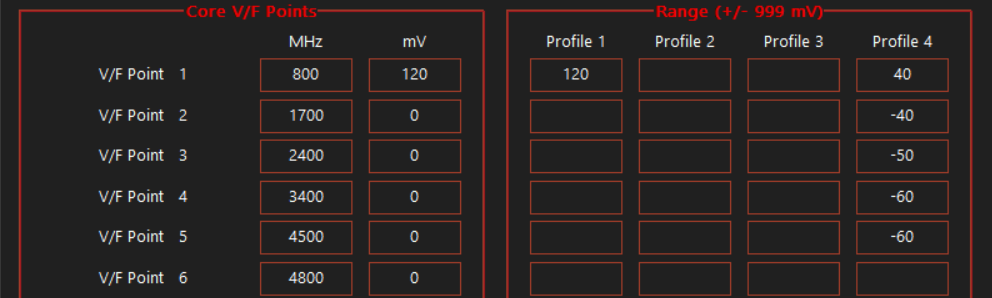
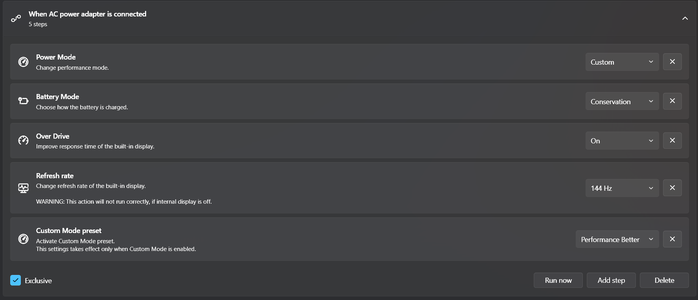
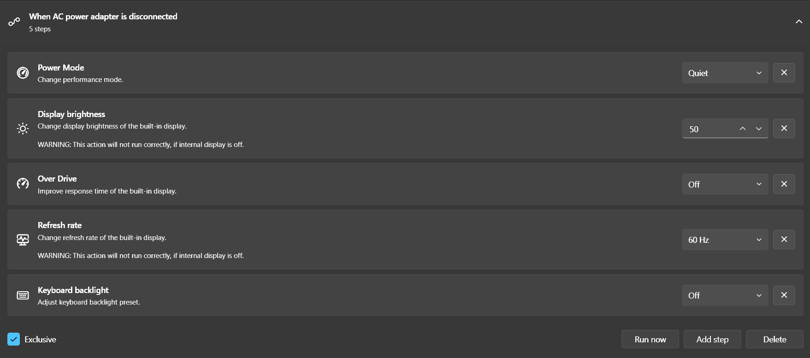

# 💻 Hardware Profile: Lenovo LOQ 2025

**Role:** Primary Workstation  
**Status:** Aquired  

---

## 🎯 Selection Rationale
Choosing a machine is a balance between raw performance and build longevity. While other models in this price bracket offered higher-tier GPUs (e.g., RTX 5050), I opted for the LOQ for a few reasons:

*   **Build Quality over Specs:** Picked a solid chassis over a slightly faster GPU. My old **Dell Inspiron 15 3542** literally fell apart(hinges snapped, body cracked) and I'm not doing that again. The LOQ actually feels sturdy enough to last a few years without disintegrating.
*   **Thermal Headroom:** By selecting the LOQ chassis, I am trading a GPU tier increase for a much more stable and cooler system.
*   **Longevity Strategy:** My goal is to maintain this machine for the long term. And both the above are important for keeping the machine alive for long.

---

## ⚙️ Specifications
| Component | Specification |
| :--- | :--- |
| **CPU** | Intel Core i7-13650HX (6 P-cores, 8 E-cores, 20 Threads) |
| **GPU** | NVIDIA RTX 4050 Laptop GPU (6GB GDDR6 VRAM) |
| **RAM** | 16GB DDR5 |
| **Storage** | 512GB NVMe PCIe 4.0 SSD |
| **Display** | 144Hz IPS Panel |
| **Battery** | ~60Whr |

---

## 📋 Maintenance & Configuration Log

### Phase 1: Clean Slate
* [ ] **OS Clean Install:** Perform a fresh Windows 11 installation to strip manufacturer bloatware and achieve a "factory-clean" state. (failed)
* [x] **System Debloat:** Apply custom scripts to disable telemetry and non-essential background processes.

### Phase 2: Linux Experimentation  (Paused due to low storage, of 512GB)
* [ ] **Fedora Workstation Deployment:** Partition the SSD to install Fedora Workstation.
* [ ] **Workflow Evaluation:** Transition daily tasks to Linux to test stability, resource efficiency, and software compatibility compared to the Windows environment.
* [ ] **Long-term Assessment:** Determine if Fedora meets the requirements for a daily driver to replace the Windows-dominant workflow.

---

## Battery Optimization & Low-Level Tuning

**Goal:** Reduce system power draw, Increase battery life.

## Technical Challenges & Bottlenecks
| Component | Hardware Constraint |
| :--- | :--- |
| **CPU:** i7-13650HX | Very inefficient at low wattage, forcing it to draw more power. Thus reducing battery life. |
| **Display:** 144Hz Panel | High Refresh rate increases panel power draw, and adds more work to the gpu. |
| **Battery:** ~60Whr | Very low battery for a HX CPU, forcing for lower system draw over raw endurance. |
| **Board Overhead:** VRM & Traces. | Desktop Class VRMS & Traces for the HX chip add ~3-5W extra over traditional laptops. |

## Implemented Solutions
* **Software Used:**
  * **ThrottleStop:** Well known tool in the community for **Undervolting**, and **Power Limits**. Required to tackle the **High power I7 HX**.
  * **Lenovo Legion Toolkit:** Well known Tool in the community for the replacement for the **Stock Bloated Lenovo Vantage**, While being lighter and             providing additional options for macros, Actions, Current System Power Draw, etc.  

* **Power Settings (ThrottleStop):**
  * **Undervolt:** -135mv constant on Core and Cache. E-Cores kept at 0 mv for stability.
  * **V/F Point Customization:** Tuned specific Voltage/Frequency points across individual profiles to optimize voltage scaling under load.
     
     *Profile 4 is used as Battery Profile*
  * **Other Settings:** Programmed strict power constraints (PL1/PL2 restricted to **15W** maxed out Speed Shift EPP to **255**. This successfully dropped        system idle power draw from **8–9W down to 6.6–7W**.

* **Other Important Implementations(Lenovo Legion Toolkit):**
  * **Actions:** 2 Actions were used. **When AC Power is connected** and **When AC Power is disconnected** to Automate Performance, and Battery without           having to manually do so.
        
        *"When AC Power is connected", the following is completed to ensure maximum performance. A.K.A revert all battery profile changes bellow.*
        
        *"When AC Power is disconnected", the following is completed to ensure lowest system power draw. Therefore, increasing battery life.*

* **Real-World Endurance Metrics:**
  * Post-optimization, battery runtime improved dramatically from an initial **0.5–1 hour** window up to **2–2.5 hours** under mixed light daily workflows (Edge browser with 3–4 tabs, Discord, and media playback), and reaching roughly **3 hours** under strict idle states.

---
*Last Updated: 2026-09-13*
